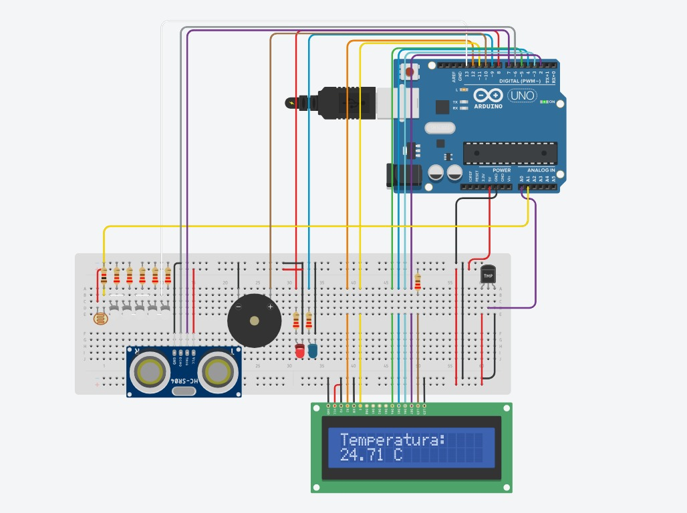

# Projeto simulação de estufa usando um Arduino (C++)
# Descrição:
- Nesse projeto construi um simulador de **estufa** usando um microcontrolador **Arduino** para que aconteça uma interação entre os componentes e assim o usuário possa tomar uma decisão com as informações recebidas, alguns comandos funcionam de maneira autonôma e serão apresentados no futuro.
- Usado o simulador Tinkercard a seguir pode-se acessar para simular o projeto, e ver o código sem a instalação do **Arduino Io**, link: https://www.tinkercad.com/things/29mp8uK15Ev-atividade-final-sensores

# Apresentação do circuito:

- Componentes:
   - Arduino Uno
   - Sensor de temperatura (LM35)
   - Sensor de espaço (HC - SR04)
   - Leds brancos, azul e vermelho
   - Resistores 220 ohm
   - Buzzer
   - Display LCD
   - LDR
- Explicação do código: Usamos as portas do Arduino para alimentar os sensores e também para realizar os comandos configurados.
  - **Monitoramento de tempo**: A ideia básica é de utilizar o **LDR** para acender os Leds brancos, caso esteja de noite eles serão acessos.
  - A seguir temos configurações para a temperatura acima de 20 graus definimos como **temperatura alta** o led vermelho é ligado, abaixo de 10 graus **temperatura baixa** o led azul é ligado e por final o intervalo (10,20) seria onde ambos os leds vermelho e azul estariam desligados indicando a temperatura ideal.
  - Usamos o **display LCD** para mostrar ao usuário o estado da tempratura. O sensor de espaço indica invasores sejam humanos ou animais a patir de uma determinada posição do sensor a entidade é enviado um comando de ligar o buzzer silizando um sinal sonoro. O Arduino é responsável por lidar com toda a parte lógica considerando claro os comandos dados pelo codígo escrito em C++.
- Conclusão: Um projeto bem simples usado para solidificar os conhecimentos básicos voltados tanto a sensores industriais e a um uso básico de C++ para controlar e simular projetos reais. As partes voltadas a conceitos de circuitos elétricos seram omitidas da descrição, estando aberto a contato para qualquer dúvida.
- Projeto elétrico: Segue abaixo o esquema usando uma notação elétrica e não viva (interativa) como o Tinkercard
  
