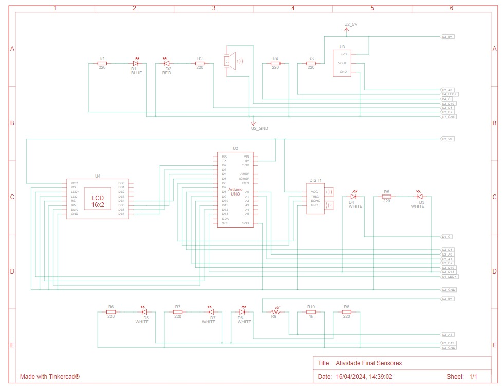

# Projeto simulação de estufa usando um Arduino (C++)
# Descrição:
- Simulador de **estufa** usando um microcontrolador **Arduino** para que aconteça uma interação entre os componentes e assim o usuário possa tomar uma decisão com as informações recebidas, alguns comandos funcionam de maneira autonôma e serão apresentados no futuro.
- Usado o simulador Tinkercard a seguir pode-se simular o projeto, e ver o código sem a instalação do **Arduino IO**  https://www.tinkercad.com/things/29mp8uK15Ev-atividade-final-sensores

# Apresentação do circuito:

- Componentes:
   - Arduino Uno
   - Sensor de temperatura (LM35)
   - Sensor de espaço (HC - SR04)
   - Leds brancos, azul e vermelho
   - Resistores 220 ohm
   - Buzzer
   - Display LCD
   - LDR
- Funcionamento do código: As portas do Arduino são usadas para alimentar os sensores e também para realizar os comandos configurados.
  - Monitoramento de tempo: A ideia é de utilizar o LDR para acender os LEDs brancos, caso seja noite. Configurações para a temperatura: acima de 20 graus definimos como temperatura alta. Nessa condição, o LED vermelho é ligado.
  - Abaixo de 10 graus a temperatura é considerada baixa e, assim, o LED azul é ligado.
No intervalo (10,20) ambos os LEDs (vermelho e azul) estão desligados, o que indicia que a temperatura é ideal.
  - O display LCD é usado para mostrar ao usuário o estado da temperatura.
  - O sensor de espaço indica invasores (humanos ou animais): a patir de uma determinada posição do sensor é enviado um comando de ligar o buzzer, que emite um sinal sonoro. O Arduino é responsável por lidar com toda a parte lógica considerando claro os comandos dados pelo codígo escrito em C++.
- Conclusão: Este projeto foi usado para solidificar os conhecimentos básicos voltados tanto a sensores industriais e ao básico de C++, com o objetivo de controlar e simular projetos reais. As partes voltadas a conceitos de circuitos elétricos serão omitidas da descrição, estando aberto a contato para qualquer dúvida.
- Projeto elétrico:
  
